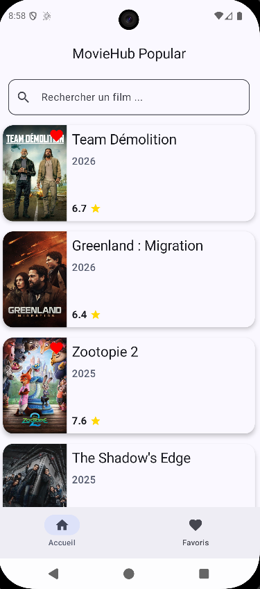
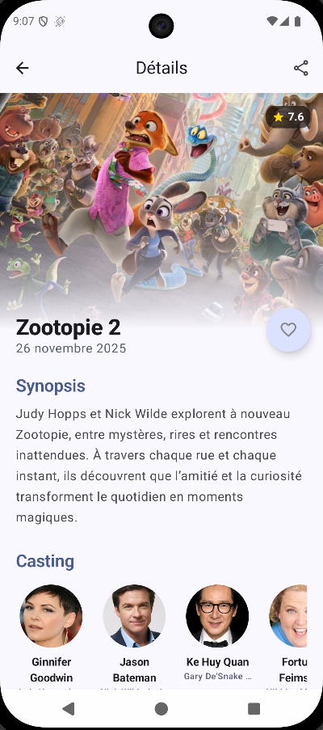
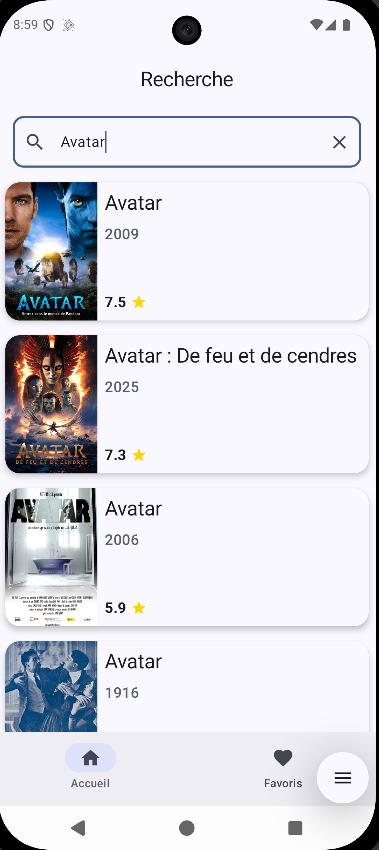

# MovieHub 🎬

MovieHub est une application Android permettant d'afficher les films populaires et d'en rechercher via l'API TMDB.
L'application est **Offline-First** avec une gestion de la pagination.

  
  
  

## 🚀 Fonctionnalités Clés

* **Architecture Offline-First** : Utilisation de Room comme *Single Source of Truth* (SSOT). L'application fonctionne parfaitement sans connexion réseau grâce au cache local.
* **Pagination Infinie** : Implémentation de Paging 3 avec `RemoteMediator` pour gérer la synchronisation API/Base de données.
* **Recherche Réactive** : Recherche instantanée avec *Debounce* et gestion des états vides/erreurs.
* **Gestion des Favoris** : Sauvegarde locale des films favoris.
* **Image Caching** : Optimisation réseau et mémoire avec Coil (Cache disque agressif).

## 🛠 Tech Stack

* **Langage** : Kotlin
* **UI** : Jetpack Compose (Material 3)
* **Navigation** : Navigation 3
* **Architecture** : MVVM + Clean Architecture (Domain/Data/UI layers)
* **Injection de dépendance** : Hilt
* **Réseau** : Retrofit
* **Base de données** : Room
* **Pagination** : Paging 3 (avec RemoteMediator)
* **Images** : Coil
* **Programmation Asynchrone** : Coroutines + Flow

## 🏗 Choix d'Architecture

### Single Source of Truth (SSOT)
L'application ne montre jamais directement les données venant de l'API.
1.  Le `RemoteMediator` récupère les données réseau.
2.  Il fusionne intelligemment les données (préserve les favoris locaux via une stratégie de *Merge*).
3.  Il sauvegarde dans Room.
4.  L'UI observe uniquement la base de données Room.
Cela garantit une cohérence totale des données et permet le support hors-ligne natif.

### Gestion des États (State Management)
Chaque écran expose un `UiState` scellé (Loading, Success, Error) via un `StateFlow`, consommé par l'UI de manière réactive.

## ⚙️ Installation Locale (Prérequis)

L'application utilise The Movie Database (TMDB) comme source de données. Pour des raisons de sécurité, la clé API n'est pas versionnée. Pour compiler le projet localement :

1. Clonez ce dépôt.
2. Créez un compte gratuit sur [TMDB](https://www.themoviedb.org/settings/api) pour générer une clé API (API Read Access Token / v3 auth).
3. À la racine du projet, ouvrez ou créez le fichier `local.properties`.
4. Ajoutez la ligne suivante en remplaçant par votre clé :
   `API_KEY=votre_cle_api_ici`
5. Synchronisez Gradle et exécutez le projet.
