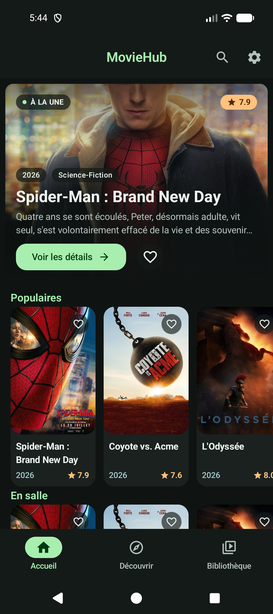
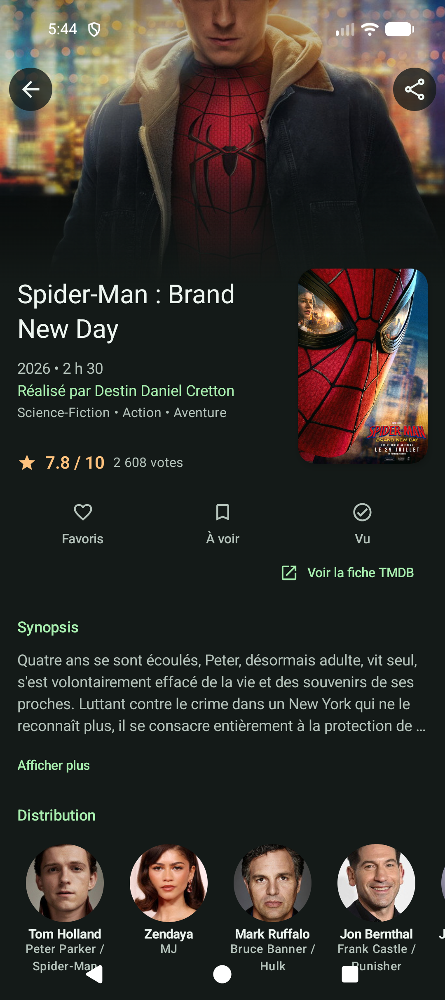
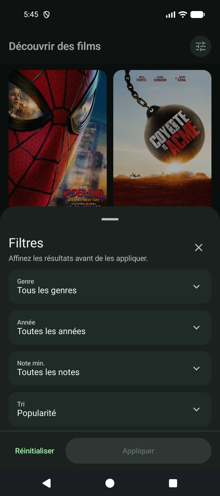
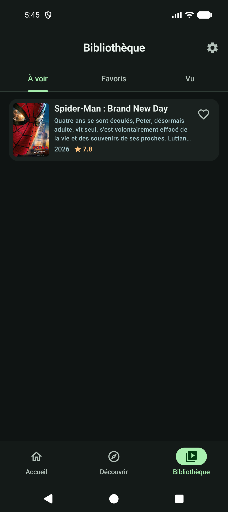
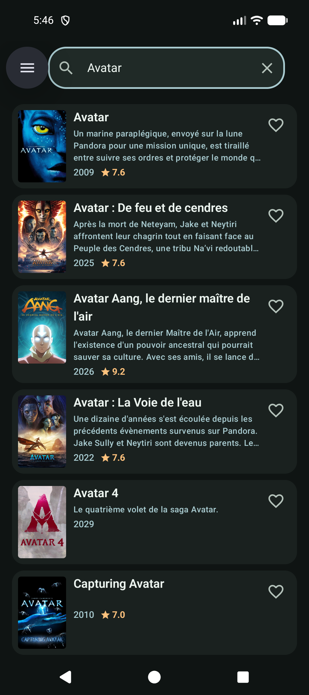
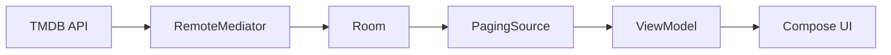

# MovieHub

**Native Android movie discovery app built with Kotlin and Jetpack Compose.**

MovieHub combines [TMDB](https://www.themoviedb.org/) content with Room-backed Home and Search feeds, flexible movie discovery, and a local Library for favorites, watchlist, and watched movies. The project keeps its product scope focused while exploring pragmatic Android architecture, Paging 3, persistence, accessible Compose UI, and automated testing.

[](https://github.com/benjaminmathias/MovieHub/actions/workflows/android.yml)


## Screenshots

<table>
  <tr>
    <td align="center"><br /><sub>Home</sub></td>
    <td align="center"><br /><sub>Movie detail</sub></td>
    <td align="center"><br /><sub>Discover filters</sub></td>
  </tr>
  <tr>
    <td align="center"><br /><sub>Library</sub></td>
    <td align="center"><br /><sub>Search</sub></td>
  </tr>
</table>

## Features

- **Home** — a featured movie and four independently paged TMDB feeds: Popular, Now Playing, Upcoming, and Top Rated, with pull-to-refresh.
- **Search** — debounced, paginated search with loading, empty, error, retry, and cached-result states.
- **Discover** — network-paged results filtered by genre, release year, minimum rating, and sort order.
- **Library** — local Watchlist, Favorites, and Watched collections with contextual removal actions. Watchlist and Watched are mutually exclusive.
- **Movie details** — synopsis, rating, runtime, genres, director, cast, recommendations, Library actions, sharing, and a direct TMDB link.
- **Settings** — system, light, and dark themes persisted with DataStore, plus Coil image-cache management.

## Technical highlights

### Offline-backed Home and Search

Home categories and search results use Paging 3 `RemoteMediator`s to synchronize TMDB pages into Room. The database remains the source of truth exposed to the UI, so cached rows stay available while a refresh runs or when the network is unavailable.



### Dynamic Discover

Discover uses a network-backed `PagingSource` because its genre, year, rating, and sort combinations are short-lived and numerous. Results are reconciled with Room-backed Library flags, while duplicate movie IDs returned across TMDB pages are removed within each paging generation to keep Compose grid keys stable.

### Local Library state

Favorite, Watchlist, and Watched flags are stored in Room and preserved when network data refreshes the same movies. Library changes flow back to Detail, Discover, and recommendation content; Detail actions update optimistically and roll back if persistence fails.

## Architecture

MovieHub uses a pragmatic layered architecture with ViewModels and unidirectional UI state:

- **UI** — Jetpack Compose screens, reusable components, Navigation 3, and screen-level ViewModels.
- **Domain** — application models and repository contracts with no Android UI dependencies.
- **Data** — repository implementations, Retrofit/OkHttp networking, Room persistence, mappers, and Paging sources/mediators.

## Engineering decisions

- **Persist feeds where reuse matters.** Home and Search benefit from Room-backed pagination and cached data; transient Discover filter combinations do not justify a persistent cache model.
- **Keep Library ownership local.** Personal movie states are updated independently of TMDB and merged into remote content across screens.
- **Keep the layering proportional to the app.** ViewModels depend on repository contracts directly; an additional use-case layer is not added where it would only forward calls.

## Tech stack

| Area | Technologies |
| --- | --- |
| Language | Kotlin |
| UI | Jetpack Compose, Material 3 |
| Architecture | MVVM, repository pattern, unidirectional UI state |
| Navigation | Navigation 3 |
| Async | Coroutines, Flow |
| Network | Retrofit, OkHttp, Gson |
| Persistence | Room, DataStore Preferences |
| Pagination | Paging 3, RemoteMediator |
| Dependency injection | Hilt |
| Images | Coil |
| Testing | JUnit 4, MockK, Turbine, Compose UI tests, Android instrumentation |
| Quality | ktlint, Android Lint, GitHub Actions |

## Testing & quality

The current suites contain **65 local unit tests** and **57 instrumented tests** covering:

- DTO/domain/entity mapping, repositories, ViewModels, debounce, and error handling;
- Paging sources, remote mediators, cached refresh behavior, and duplicate-page results;
- Room paging behavior, local-flag preservation, and database migrations through schema version 5;
- Compose UI, navigation, accessibility semantics, and Library interactions;
- optimistic Library updates, rapid state changes, failure rollback, and cross-screen reconciliation.

Instrumented integration paths use an in-process Room database and a deterministic fake TMDB service where network behavior is involved. Critical user flows have also been checked manually on an Android emulator, including offline behavior, pagination, Library state changes, and phone/tablet layouts.

## Continuous integration

The [`Android CI`](.github/workflows/android.yml) workflow runs on pushes and pull requests targeting `main` or `master`. It verifies:

```text
ktlintCheck -> lintDebug -> testDebugUnitTest -> assembleDebug
```

Instrumented tests remain a local device/emulator check and are not run by this workflow.

## Setup

1. Clone the repository:

   ```bash
   git clone https://github.com/benjaminmathias/MovieHub.git
   cd MovieHub
   ```

2. Create a TMDB API key from the [TMDB API settings](https://www.themoviedb.org/settings/api).

3. Add the key to the root `local.properties` file:

   ```properties
   TMDB_API_KEY=your_api_key_here
   ```

4. Open the project in Android Studio and run the `app` configuration, or build it with the Gradle wrapper.

## Build & verify

```bash
./gradlew assembleDebug
./gradlew testDebugUnitTest
./gradlew lintDebug
./gradlew ktlintCheck
```

Run the instrumented suite with a connected device or emulator:

```bash
./gradlew connectedDebugAndroidTest
```
